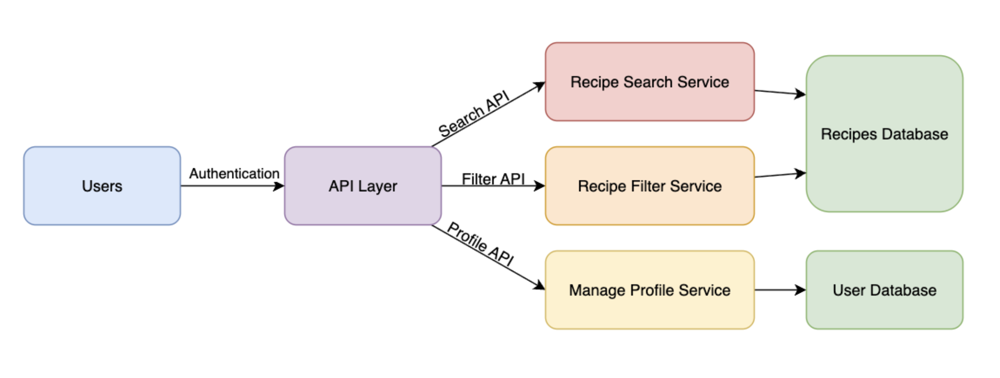
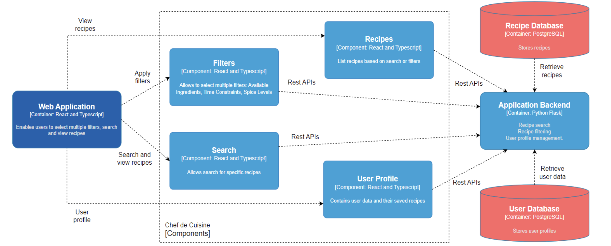

# Chef de Cuisine

## Abstract: Summarise the key points of your document.

## Proposal Changes

*View the original proposal here:* https://github.com/CSSE6400/project-proposal-2025/blob/main/s4955583/proposal.md

There were no changes made to the core functionality of the Minimum Viable Product (MVP). The project's focus is to deliver all MVP features as planned in the original proposal. However, after a close review during team discussions, it was identified that many quality attributes lacked sufficient justification or relevance to the goals of the project at its current stage. As a result, the team mutually agreed to refine the quality attributes to include only the three most critical and applicable characterisitics which are; Availability, Extensibility and Scalability. These attributes were selected based on their direct impact on the system's reliability, long-term adaptibility and capacity to serve users efficiently under varying loads.

The reasons to exclude the other attributes are as follows:

- Deployability

    - When completing the MVP, deployability doesn't become enough of a bottleneck to our workflow and deployment. At this stage, manual deployment is acceptable since we're focused on running core features reliably at scale.

    - More advanced deployment strategies (which are out of scope for this course) are not worth the time investment nor the opportunity cost.

- Maintainability

    - Our codebase is relatively small with 6 contributors total. At a larger scale with several more contributors, maintainability would become critical for future development.

    - Rapid development at a small scale is a much higher priority.

- Modularity

    - Modularity gets intertwined with extensibility to some degree since we're using a microservices architecture. Each service is its own modular component.

    - Overengineering for modularity would slow down development when time is already scarce.

- Reliabilty

    - Availability often overlaps with reliability so occassional downtime is tolerable especially outside of lunch and dinner hours. These hours are generally used for site maintenance as traffic is very low.

    - Full-blown fault tolerance and redundancy measures are usually deferred post-MVP stages and closer to a full release.

- Security

    - At this stage, the amount of sensitive data exposure is extremely minimal. We acknowledge security to be important in almost any application but the additional complexities that arise are not worth it for the MVP.

    - Placeholder security measures such as static JWT tokens are sufficient for testing purposes until it becomes available to the public.

- Testability

    - Our testing suite only covers critical flows we expect a user to follow. Building a full, robust test suite is time consuming and slows down development. However, we have compiled a small testing suite in isolation using mock accounts.

Overall, these refinements ensures that the architectural and development decisions remain focused and aligned with the MVP along with considering the available time left in the project.

## Architecture Options

As a team, we have discussed and investigated different software architectures such as monolithic, layered, microservices, event-driven and serverless. 

**Monolithic**

| Pros | Cons |
| :- | :- |
| Easier to develop, test, and deploy as a single unit. Conceptually simpler. | Can only be scaled as a whole rather than by component. |
| In-process calls are faster than inter-service communication. | Small changes may require redeploying the whole system. |
| Easier to set up with common IDEs, debuggers, and profilers. | Becomes very complex and fragile as it grows. |
| Easier to manage ACID transactions across components. | A bug in one part can affect the entire application. |
| Lower running costs on the cloud. | One issue takes the whole system down. |

**Layered (n-tier)**

| Pros | Cons |
| :- | :- |
| Easier to organize code by responsibility (UI, business logic, data access). | Can lead to performance overhead due to multiple abstraction layers. |
| Layers can be reused across different applications. | Hard to skip or bend layers without breaking architecture rules. |
| Logical separation makes the system easier to understand and evolve. | Often implemented as a monolith; all layers tightly coupled in one deployment. |

**Microservices**

| Pros | Cons |
| :- | :- |
| Services can be updated and scaled independently. | Requires complex service orchestration, service discovery and monitoring. |
| Teams can use different languages or frameworks per service. | Network latency, consistency and failure handling become critical. |
| Failure in one service is unlikely to crash the entire system. | Transactions across services are hard to implement. |
| Maps well to small, autonomous dev teams. | Requires more complex CI/CD, monitoring, and testing practices to ensure reliability. |

**Event-Driven**

| Pros | Cons |
| :- | :- |
| Services communicate via events, promoting independence. | Hard to trace and debug system behavior across async events. |
| Highly scalable, especially for systems with asynchronous workloads. | Eventual consistency models require careful design. |
| Ideal for streaming data and reactive systems. | More complex to test and simulate event flows and edge cases. |
| Components can operate independently and retry logic can be built in. | Needs reliable messaging infrastructure like RabbitMQ, etc. |

**Serverless**

| Pros | Cons |
| :- | :- |
| Infrastructure handled by cloud provider. | Longer than usual latency during initial function invocation. |
| Functions scale automatically with demand. | Heavy reliance on specific cloud provider APIs and services. |
| Pay only for execution time, not idle compute. | Functions are stateless, requiring external storage for state. |
| Great for prototyping and lightweight services. | Local testing and debugging can be challenging. |

With the selected quality attributes from earlier project planning, a microservices architecture accomodates the given criteria the best as we're prioritising independent scaling, collaborative teamwork for a small team and smoother application operation.

## Architecture

Our application consists of multiple serivces designed to specialise to handle specific functionality independently.

The MVP consists of 3 services:

- Search Service

    - Search recipes by name using keywords or phrases.

- Filter Service

    - Search recipes using recipe attributes (ingredients list, rating, cooking time, etc.).

- User Service

    - Manage user details, preferences and favourite recipes.

Services communicate to one another synchronously using the REST API framework over HTTP. For this application, requests are simpler and a single request doesn't place high loads on the system. The backend REST API is written in Python using Flask, PostgreSQL as our database and Docker for containerisation. The frontend UI elements are written in TypeScript. Using AWS ECS (Fargate) and ECR, we deployed each service as a docker image to the cloud. AWS autoscaling with an application load balancer (ALB) handles the balance between resource usage and site traffic. Each service scales independently to cater for it's own load.

Authentication is handled using a JWT token across services for accessing the API in a secure manner to ensure user-entered data is well-formed and the intent is not malicious. During use, if a service becomes unhealthy for an unknown reason, it will attempt to restart which may take some time (in the order of minutes). All actions are monitored and logged using AWS CloudWatch with alarms for scaling purposes.

There are 2 PostgreSQL databases, one for recipes and the other for users. Keeping the databases separate allows each service to only access the information it requires. In the event a service becomes unhealthy, it reduces the likelihood of data becoming lost which may result in user frustration and a poor user experience.

**Architecture Diagram**

**Component Diagram**

## Trade-Offs

From the 'Architecture Options' section, below is a summary of the trade-offs we considered collectively when designing our architecture.

- Requires complex service orchestration, service discovery, and monitoring.

    - While orchestration and monitoring add overall complexity during development, they directly enable independent service scaling and deployment, which is essential for a microservices architecture.
    
    - This allows our application to have more autonomy and be scalable which meets one of our core quality attributes.

- Network latency, consistency, and failure handling become critical.

    - As our application is not super time sensitive, the additional network latency is acceptable without negatively affecting the user experience in a significant manner.

    - Eventual consistency is a necessary trade-off for scalability and service decoupling. By accepting some small delay is data propagation, the system becomes more robust and scalable.

    - An example of this is when a new recipe gets added and shows up in search shortly after it's added.

- Data synchronisation and consistency is difficult to manage when accessing newly added recipes.

    - Instead of using 1 universal shared database, using multiple smaller databases allows each service type to only access the data it needs. This reduces the likelihood of malformed data written to the database.

    - When a service becomes unhealthy, data could be lost/corrupted. This reduces the severity of data loss to be more recoverable/retrievable and becomes more secure from attacks (like a data breach).

    - The user database is the most important as it contains the most user sensitive information so having that separate from the recipe database reduces the number of accesses and in the event something does occur, it will be easier to find the root cause. 

- Debugging inter-service related issues is much more difficult and requires more time.

    - The system as a whole gains fault isolation but it becomes more difficult to debug as traces are generally spread around different services. Centralised logging tools like AWS CloudWatch help mitigate this tradeoff to find root-causes.

    - Clear API contracts (the expected input and output) provide better observability and long-term reliability for easier maintenance and faster root-cause analysis.

- Requires more complex CI/CD, monitoring, and testing practices to ensure reliability.

    - Setting up complex CI/CD piplines is time consuming and can consume more budget at the start of a project. However, it enforces discipline and motivation which in turn improves reliability and speeds up releases in the long term. This allows for faster future development at the cost of slower present development.

    - If the CI/CD pipline isn't set up correctly, the microservice won't deploy properly which would lead to more problems. Generally, it's a more high risk, high reward situation.

    - For the MVP, this isn't so critical as we haven't implemented any complex monitoring or testing systems. However, having a microservices architecture makes the need more visible in the future.

## Critique: Describe how well the architecture supports delivering the complete system.

## Evaluation: Summarise testing results and justify how well the software achieves its quality attributes.

## Reflection: Lessons learnt and what you would do differently.

This project was a valuable learning experience, both technically and collaborative teamwork. Over the course of building and deploying our Chef de Cuisine application using a microservices architecture, we encountered a range of challenges and opportunities that shaped our understanding of modern software development practices, cloud deployment, and team-based problem-solving.

One of the key lessons we learnt was the importance of coordination when working on a short-term team project. With multiple services to develop, integrate, and deploy, it became apparent how crucial communication was in avoiding duplication of effort and ensuring alignment on architectural decisions. Early on, we struggled to decide on an architecture to use which delayed our project start. We experienced some friction around responsibilities and timelines, but quickly adapted by becoming more proactive in checking in with each team member and documenting our work in a shared place. By using the backlog, we could assign tasks to ourselves and see what others were working on. This reduced redundant work and help align finished tasks with starting new tasks.

Another significant learning moment came from deploying our application on AWS. Although we were familiar with cloud platforms in theory, deploying a distributed, container-based system in practice brought up a range of unexpected issues. For many of us, this was our first cloud computing course so we were still grasping the fundamentals. This made the deployment process longer than we had originally anticipated. From configuring load balancers and ECS task definitions to debugging security group permissions and health checks, we faced a steep learning curve. These challenges highlighted the importance of observability and infrastructure-as-code — areas we only scratched the surface of. Despite the complexity, resolving these issues taught us resilience and resourcefulness, and the satisfaction of finally seeing the full stack live in production was a rewarding moment for the whole team.

We found our in-person meetups being far more effective than online check-ins. Discussions moved faster, misunderstandings were resolved more easily, and decisions were made more confidently. Progress in these sessions was higher presumably from everyone being in the right state of mind to fully contribute. While remote work has its place, we’d plan for more regular face-to-face sessions, especially during key points like architectural planning, integration, and deployment.

Given another opportunity to approach this project again, one of the first things we’d do differently is start figuring out the important details earlier. Time is already limited in this project so we had to make the most of each day given. We were provided with our repository later than expected and the drama regarding our team's AWS accounts prevented us from getting the headstart we were aiming for. Because much of the deployment work came toward the end, we were time-constrained when debugging and stress-testing our system. Starting the infrastructure setup in parallel with early backend development would have allowed more time for refinement and testing.

Lastly, while our microservices architecture enabled flexibility and separation of concerns, it introduced complexity making some tasks harder than otherwise for an MVP. If the project was smaller in scope, a monolith or layered architecture might have been more pragmatic. However, the architecture choice gave us a realistic taste of challenges we’re likely to encounter in industry-scale projects, and those lessons are invaluable. Furthermore, being able to apply the AWS deployment skills into a practical project helped strengthen our cloud knowledge. The experience strengthened our technical skills and ability to collaborate effectively under pressure. Next time, with earlier setup, more structured collaboration, and lessons from deployment fresh in mind, we believe we could move faster and more confidently through both development and production phases.
